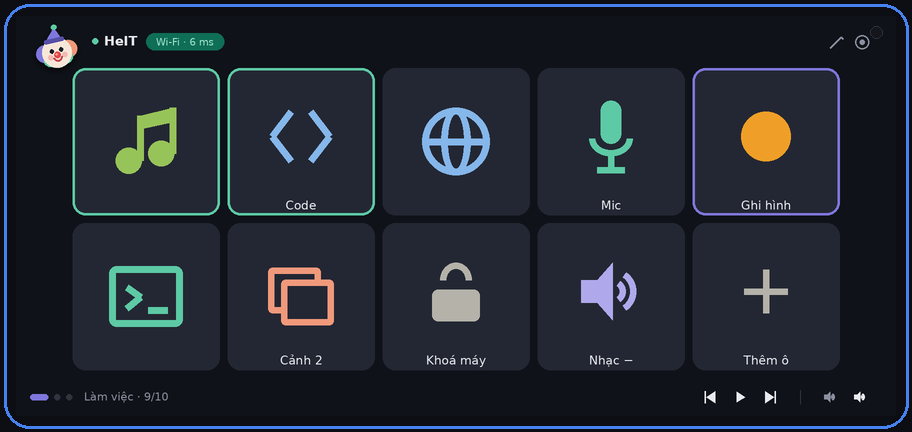
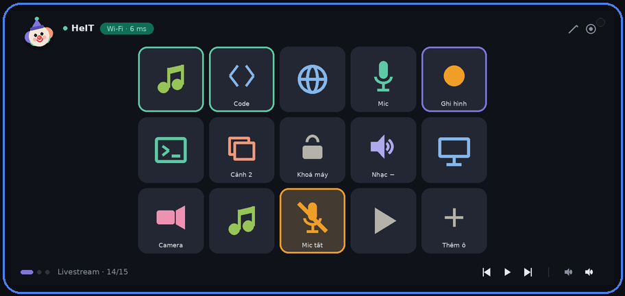

<div align="center">


# HeDeck

**Biến điện thoại Android thành bàn điều khiển cho laptop Windows.**

Chạm một ô là ứng dụng trên máy tính mở lên và nhảy ra trước. Kèm điều khiển
nhạc, âm lượng riêng từng ứng dụng, và các ô macro gõ tổ hợp phím.



</div>

---

## Nó làm được gì

| | |
|---|---|
| **Mở và chuyển ứng dụng** | Chạm ô là app mở lên rồi nhảy ra trước. Đang chạy thì chạm để thu nhỏ, giữ 3 giây để tắt hẳn. |
| **Macro phím tắt** | Một ô gõ `ctrl+shift+p`, hoặc cả chuỗi nhiều bước. |
| **Âm lượng riêng từng app** | Hạ nhạc nền mà không hạ giọng nói — thứ mà nút âm lượng trên bàn phím không làm được. |
| **Ô hai trạng thái** | Bấm bật, bấm lại tắt. Mỗi mặt có icon và màu riêng, nhìn từ xa là biết mic đang bật hay tắt. |
| **113 icon vector** | Chọn icon cho từng ô, nét ở mọi kích thước. Hoặc dùng icon thật của ứng dụng. |
| **Nhiều trang** | Vuốt ngang để đổi. Mỗi trang 10 hoặc 15 ô, tuỳ bố cục 5×2 hay 5×3. |
| **Điều khiển nhạc** | Thanh media cố định dưới màn hình, không tốn ô nào. |

Ai dùng hợp: người livestream cần đổi cảnh và tắt mic nhanh, người làm việc
nhiều cửa sổ, hoặc bất kỳ ai cắm laptop vào TV và ngồi xa bàn phím.

---

## Cách hoạt động

```
   Điện thoại Android            Cùng mạng Wi-Fi              Laptop Windows
  ┌──────────────────┐                                    ┌──────────────────┐
  │   HeDeck (app)   │ ──── WebSocket ws://<ip>:8787 ────▶│  HeDeck Agent    │
  │  lưới ô, macro   │                                    │  mở app, focus   │
  │  media, âm lượng │ ◀─── trạng thái mỗi 1,5 giây ──────│  cửa sổ, gõ phím │
  └──────────────────┘                                    └──────────────────┘
```

Cần **hai phần**: app trên điện thoại và agent chạy nền trên laptop. Điện thoại
không tự mở được ứng dụng trên máy tính, nên agent là bắt buộc.

---

## Yêu cầu

**Laptop**
- Windows 10 hoặc 11
- [Python 3.10+](https://www.python.org/downloads/) — nhớ tick *Add python.exe to PATH* lúc cài

**Điện thoại**
- Android 7.0 trở lên
- Cùng mạng Wi-Fi với laptop

**Chỉ cần nếu bạn tự build từ mã nguồn**
- [Flutter SDK](https://docs.flutter.dev/get-started/install/windows) — giải nén vào `C:\flutter`, tránh thư mục có dấu cách
- [Android Studio](https://developer.android.com/studio) để có Android SDK

---

## Cài đặt

### Bước 1 — Chạy agent trên laptop

```
agent\run_agent.bat
```

Lần đầu mất khoảng một phút để tự tạo môi trường ảo và cài thư viện. Windows
Firewall sẽ hỏi — chọn **Cho phép ở mạng riêng (Private networks)**.

Cửa sổ hiện ra:

```
  ┌─────────────────────────────────────────────┐
  │  HeDeck Agent · DESKTOP-A1B2C3              │
  │  Địa chỉ  : ws://192.168.1.12:8787          │
  │  Mã ghép  : 481902  (còn 4p58s)             │
  │  Ứng dụng : 75  (danh mục v9)               │
  │  Bảo vệ   : chỉ mạng nội bộ · Ed25519       │
  └─────────────────────────────────────────────┘
  Enter: mã mới · U: gỡ chặn IP · D: xoá thiết bị · Ctrl+C: thoát
```

Ghi lại **địa chỉ IP** và **mã 6 số**. Giữ cửa sổ này mở trong lúc dùng.

### Bước 2 — Cài app lên điện thoại

Cắm điện thoại đã bật [gỡ lỗi USB](https://developer.android.com/studio/debug/dev-options),
rồi nháy đúp ở thư mục gốc:

```
setup_app.bat      (lần đầu trên mỗi máy)
CHAY_APP.bat       (những lần sau)
```

Muốn có file APK cài độc lập, không cần cáp:

```
BUILD_APK.bat
```

File nằm ở `flutter_app\build\app\outputs\flutter-apk\app-release.apk`.

### Bước 3 — Ghép cặp

Mở app, nhập địa chỉ IP và mã 6 số ở Bước 1, bấm **Ghép cặp**. Xong.

Mã dùng một lần và hết hạn sau 5 phút. Sau khi ghép, điện thoại tự kết nối ở
những lần mở app sau — kể cả khi router đổi IP của laptop.

---

## Dùng hàng ngày

### Thao tác

| Làm gì | Được gì |
|---|---|
| Chạm ô ứng dụng chưa chạy | Mở app rồi đưa ra trước |
| Chạm ô đang chạy | Thu nhỏ cửa sổ |
| Chạm ô app có nhiều cửa sổ | Xoay vòng qua từng cửa sổ |
| **Giữ 3 giây** ô đang chạy | Tắt hẳn app, viền đỏ chạy dần làm đồng hồ đếm |
| Giữ ô chưa chạy, macro, media | Mở màn hình sửa ô |
| Vuốt trái phải | Đổi trang |
| Nút bút chì | Bật chế độ sửa, chạm ô nào cũng là sửa |
| Nút cộng ở thanh dưới | Thêm ô vào chỗ trống, hết chỗ thì tự tạo trang mới |
| Chạm logo chú hề | Mở menu tuỳ chọn |

### Màu viền ô

| Viền | Nghĩa |
|---|---|
| Không viền | Chưa mở |
| **Tím** | Vừa bấm mở, đang chờ cửa sổ hiện ra |
| **Xanh lục** | Đang chạy |
| **Đỏ chạy dần** | Đang giữ để tắt |
| Nền sáng + viền màu | Ô hai trạng thái đang ở mặt phụ |

### Tạo ô

Chạm dấu cộng → chọn loại ô:

- **Ứng dụng** — chọn từ danh sách app trên laptop
- **Macro** — nhập tổ hợp phím, nhiều bước thì ngăn bằng dấu phẩy: `win+d, alt+tab`
- **Media** — phát, tạm dừng, bài kế, âm lượng chung
- **Âm lượng** — chỉnh tiếng của đúng một app, mỗi lần bấm đổi 5%

Rồi đặt tên (không bắt buộc), chọn icon và màu. Bật **Ô hai trạng thái** nếu
muốn bấm bật bấm tắt.

### Bố cục



Vào bánh răng để đổi giữa **5×2** (10 ô, ô lớn) và **5×3** (15 ô, ô nhỏ hơn).
Đổi qua lại không mất dữ liệu — mỗi trang luôn giữ đủ 15 chỗ.

---

## Bảo mật

Ba tầng độc lập nhau:

1. **Chỉ mạng nội bộ.** Agent từ chối mọi kết nối từ ngoài dải IP nội bộ, kể cả
   khi có ai đó mở cổng ra Internet.
2. **Phát hiện IP lạ.** Sai mã 5 lần thì khoá tạm 15 phút; tái phạm 3 lần thì
   chặn vĩnh viễn. Cảnh báo hiện thẳng trên cửa sổ agent kèm địa chỉ IP.
3. **Chữ ký một chiều.** Điện thoại sinh cặp khoá Ed25519; khoá bí mật không
   bao giờ rời khỏi máy. Laptop chỉ giữ khoá công khai, nên đọc trộm file cấu
   hình trên laptop cũng không giả mạo được thiết bị.

Ngoài ra, điện thoại **chỉ gửi mã định danh ứng dụng**, không bao giờ gửi đường
dẫn hay lệnh shell. Kể cả khi vượt được cả ba tầng, kẻ tấn công chỉ mở được đúng
những app đã có sẵn trong danh mục trên laptop.

**Giới hạn cần biết:** kênh truyền là `ws://` chưa mã hoá. Người cùng mạng có
thể thấy bạn mở app nào, dù không thể tự mở app. Ở mạng nhà thì chấp nhận được,
ở Wi-Fi công cộng thì không nên dùng.

---

## Xử lý sự cố

<details>
<summary><b>App không kết nối được</b></summary>

Kiểm tra theo thứ tự:

1. Cửa sổ agent còn mở không
2. Hai máy có **cùng một mạng Wi-Fi** không — cẩn thận mạng khách, và router
   phát hai SSID riêng cho 2.4 GHz với 5 GHz
3. Windows Firewall đã cho phép Python ở mạng riêng chưa
4. IP của laptop có đổi không — bấm nút **↻** trên thanh trên của app

App tự thử lại mãi, tối đa 20 giây một lần, và tự dò lại địa chỉ mới bằng mDNS
sau vài lần hụt.
</details>

<details>
<summary><b>Danh sách ứng dụng trống, hoặc kẹt ở "Đang lấy danh sách"</b></summary>

Xem cửa sổ agent có dòng `Danh sách sẵn sàng: N ứng dụng` chưa. Nếu chưa, chạy
công cụ chẩn đoán:

```
cd agent
.\.venv\Scripts\python.exe kiem_tra_quet.py
```

Nó đi qua 8 bước và in ra bước nào hỏng kèm nguyên nhân.
</details>

<details>
<summary><b>Ứng dụng mở nhưng không nhảy ra trước</b></summary>

App đó chạy quyền quản trị. Chạy agent bằng quyền Administrator là được.
</details>

<details>
<summary><b>Không thấy ứng dụng nào đó trong danh sách</b></summary>

Agent chỉ quét shortcut trong Start Menu. Thêm tay vào
`%USERPROFILE%\.hedeck\catalog.json` theo mẫu có sẵn rồi khởi động lại agent.
</details>

<details>
<summary><b>Icon một số app bị mờ</b></summary>

File `.exe` của app đó chỉ nhúng icon nhỏ. Kiểm tra bằng `kiem_tra_quet.py`,
bước 8 in độ phân giải từng app. Với những app dưới 128px, cách duy nhất để nét
hơn là chọn icon vector từ thư viện trong màn hình sửa ô.
</details>

<details>
<summary><b>Ghép cặp báo "Thiếu khoá công khai"</b></summary>

Màn hình ghép cặp có dòng *Khoá thiết bị XXXX:XXXX:XXXX* ngay trên nút bấm.
Hiện vân tay là khoá đã có; hiện chữ đỏ nghĩa là khâu tạo khoá hỏng, và thông
báo lúc bấm Ghép cặp sẽ nói rõ lý do.
</details>

<details>
<summary><b>Lỗi build Kotlin trên Windows</b></summary>

Các thông báo `different roots`, `Could not close incremental caches`, hoặc
`Storage is already registered` đều thuộc một nhóm lỗi của Kotlin trên Windows,
không liên quan tới HeDeck. Chạy:

```
CHAY_APP.bat
```

Nó cấu hình Gradle ở **cấp máy** (`%USERPROFILE%\.gradle\gradle.properties`) và
dừng daemon cũ trước khi build. Cấu hình cấp máy tồn tại độc lập với project nên
có hiệu lực cả khi bạn xoá `android/` hay đổi thư mục.

Lỗi khác thì thử `SUA_LOI_ANDROID.bat`, `SUA_LOI_PLUGIN.bat`,
`SUA_LOI_KHAC_O_DIA.bat`.
</details>

<details>
<summary><b>Màn hình đen sau khi logo chạy xong</b></summary>

Nếu màn đen xuất hiện **đúng lúc vòng tối lan hết màn hình**, đó là lỗi ở màn
hình mở đầu, đã sửa từ bản này. Cập nhật mã nguồn rồi chạy lại.

Log sẽ in `HeDeck: bỏ màn hình mở đầu (hoạt ảnh xong)` khi nó kết thúc bình
thường, hoặc `(hết thời gian chờ)` khi lưới an toàn phải can thiệp.
</details>

<details>
<summary><b>Màn hình đen ngay từ đầu, log không báo lỗi gì</b></summary>

Thử tắt Impeller — trình vẽ mới của Flutter, đôi khi không vẽ được trên GPU ảo:

```powershell
flutter run --no-enable-impeller
```

Hết đen nghĩa là do Impeller. Trên máy ảo, đổi **Graphics** sang
**Hardware - GLES 2.0** trong Device Manager thường giải quyết được gốc rễ.

Lưu ý: cờ này sắp bị Flutter gỡ bỏ, nên đừng dựa vào nó lâu dài. Nếu bạn phát
hiện tình huống nào Impeller vẽ sai, hãy báo cho Flutter — thường là một API vẽ
cụ thể không được hỗ trợ, tránh dùng API đó là xong. HeDeck từng vấp phải điều
này với `MaskFilter.blur` trong logo, và đã thay bằng cách xếp lớp.
</details>

<details>
<summary><b>Test trên máy ảo Android</b></summary>

Máy ảo không thấy được mạng LAN của laptop. Mở cửa sổ PowerShell thứ hai:

```powershell
adb reverse tcp:8787 tcp:8787
```

Rồi trong app nhập IP `127.0.0.1` thay vì `192.168.x.x`. Chạy lại lệnh này mỗi
khi khởi động lại máy ảo.
</details>

---

## Cấu trúc thư mục

```
hedeck/
├── CHAY_APP.bat           chạy app lên thiết bị
├── setup_app.bat          dựng project Android lần đầu
├── BUILD_APK.bat          xuất APK bản phát hành
├── SUA_LOI_*.bat          các script sửa lỗi môi trường
├── DON_DEP.bat            xoá file thừa sót lại từ bản cũ
├── agent/                 phần chạy trên laptop Windows
│   ├── run_agent.bat
│   ├── agent.py           server WebSocket, ghép cặp, xác thực
│   ├── win_control.py     mở app, focus cửa sổ, gõ phím
│   ├── catalog.py         quét Start Menu
│   ├── icon_source.py     lấy icon độ phân giải gốc
│   ├── app_volume.py      âm lượng riêng từng app
│   ├── security.py        chặn IP lạ, chữ ký Ed25519
│   └── kiem_tra_*.py      công cụ tự kiểm tra và chẩn đoán
├── flutter_app/lib/       phần chạy trên điện thoại
├── android_patch/         script cấu hình Android và Gradle
├── tools/make_icon.py     script vẽ logo
└── docs/KY_THUAT.md       tài liệu kỹ thuật chi tiết
```

---

## Đóng góp và phát triển

Hai tài liệu đi kèm:

- [`docs/BAT_DAU.md`](docs/BAT_DAU.md) — hướng dẫn cài đặt chi tiết từng bước,
  dành cho người chưa từng dùng Flutter
- [`docs/KY_THUAT.md`](docs/KY_THUAT.md) — giao thức, kiến trúc, quyết định
  thiết kế và lý do đằng sau từng lựa chọn

Trước khi gửi thay đổi cho phần agent, chạy bộ tự kiểm tra:

```
cd agent
python kiem_tra_agent.py
```

Nó đọc mã nguồn bằng AST và bắt những lỗi mắt người dễ bỏ sót: một tác vụ nền
khai báo rồi nhưng chưa được khởi động, một phương thức không ai gọi, một lệnh
thiếu nhánh xử lý.

**Hướng phát triển còn bỏ ngỏ:** kết nối Bluetooth, touchpad ảo, nâng lên
`wss://` có mã hoá, ô nhiều bước có độ trễ, đóng gói agent thành dịch vụ chạy
nền cùng Windows.

---

## Tác giả

**Hề IT**

Tên HeDeck ghép từ **Hề** và **Deck**, nên logo là một chú hề.

---

## Giấy phép

Chưa chọn giấy phép. Nếu bạn định công khai mã nguồn, cân nhắc thêm file
`LICENSE` — [MIT](https://choosealicense.com/licenses/mit/) là lựa chọn phổ biến
và dễ hiểu cho dự án kiểu này.
